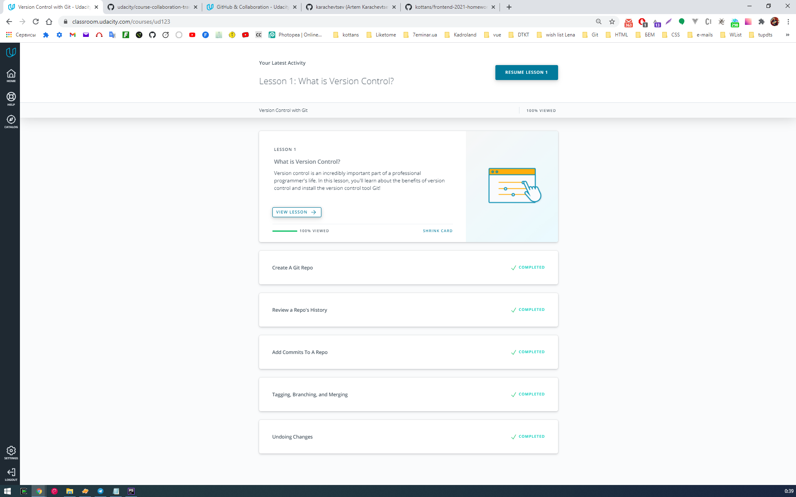
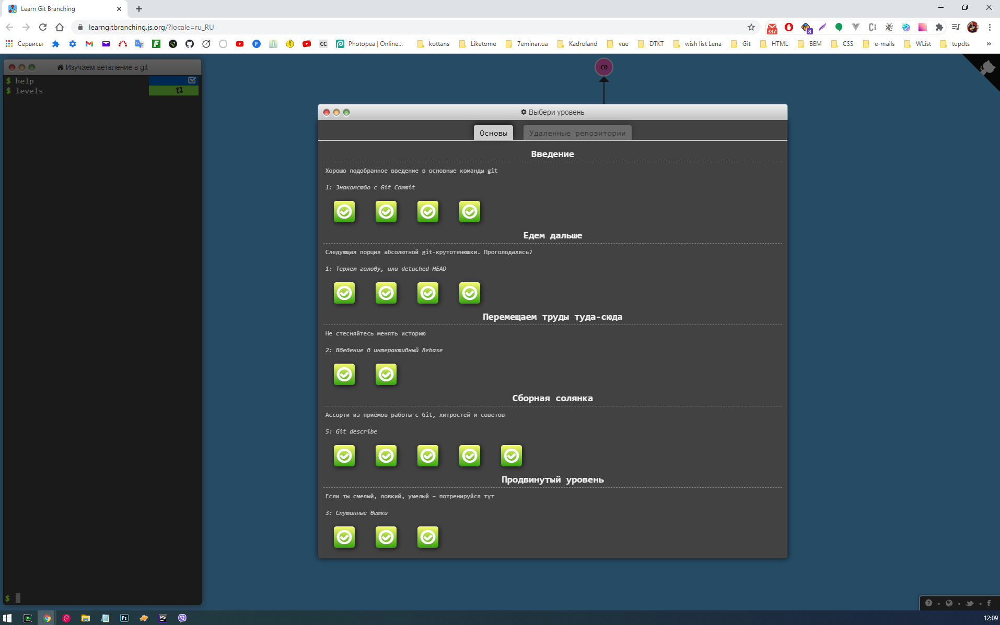
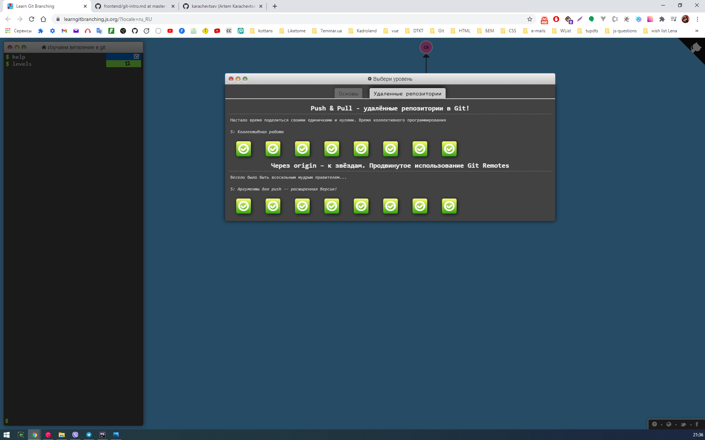

# kottans-frontend
Self study completed tasks

## General
- [x] 0 - Git and GitHub - `completed` 
- [ ] 1 - Linux CLI and Networking
- [ ] 2 - Git for Team Collaboration

## Front-End Basics
- [ ] 3 - Intro to HTML & CSS
- [ ] 4 - Responsive Web Design
- [ ] 5 - HTML & CSS Practice
- [ ] 6 - JavaScript Basics
- [ ] 7 - Document Object Model - practice

## Advanced Topics
- [ ] 8 - Building a Tiny JS World (pre-OOP) - practice
- [ ] 9 - Object oriented JS - practice
- [ ] 10 - OOP exercise - practice
- [ ] 11 - Offline Web Applications
- [ ] 12 - Memory pair game — real project!
- [ ] 13 - Website Performance Optimization
- [ ] 14 - Friends App - real project!

##0 - Git and GitHub

####Impressions about learned materials:

It was interesting to know about the option --amend for git commit, to alter the last commit and git log options --oneline, --decorate, --stat, --graph.

