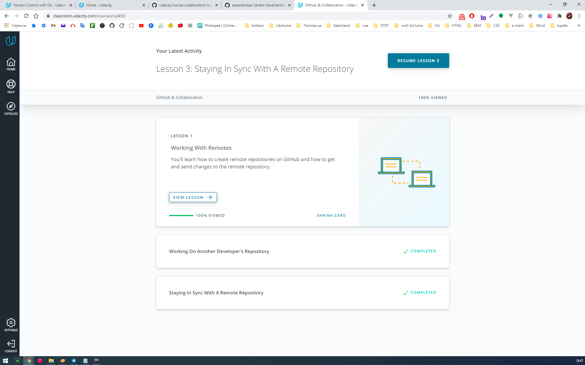
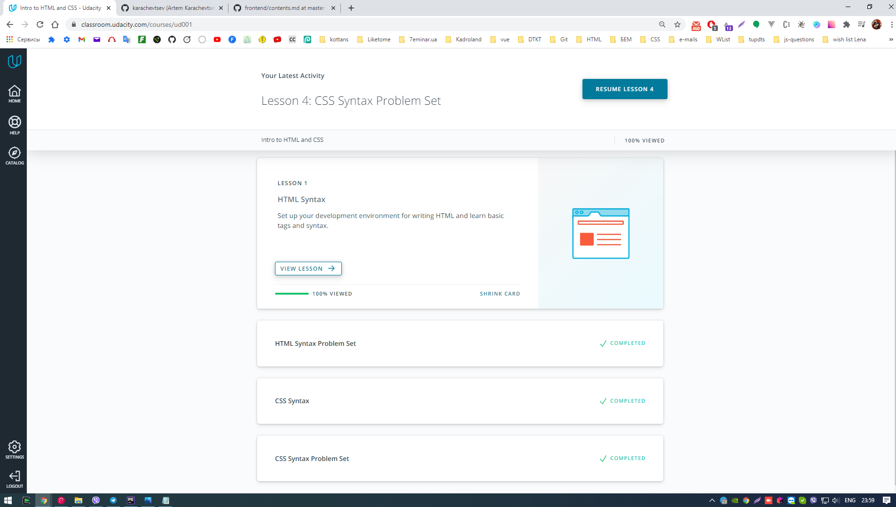
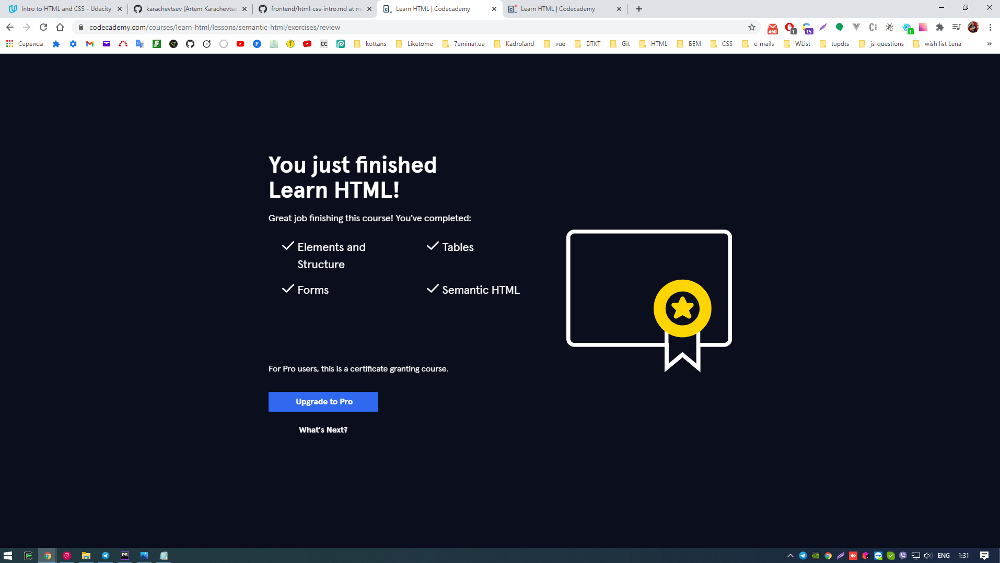
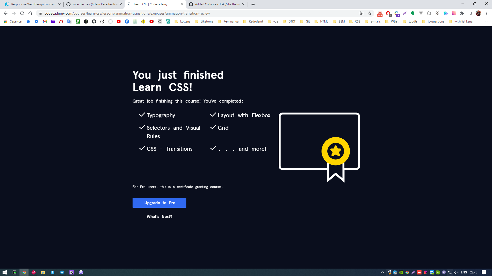
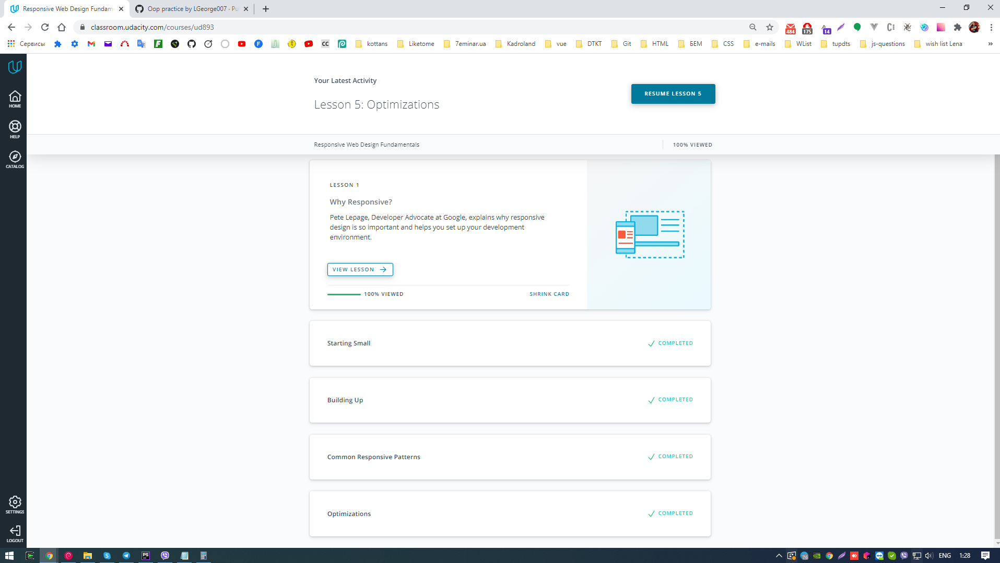

# kottans-frontend
Self study completed tasks

## General
- [x] 0 - Git and GitHub - `done` 
- [x] 1 - Linux CLI and Networking - `done` 
- [X] 2 - Git for Team Collaboration - `done`

## Front-End Basics
- [X] 3 - Intro to HTML & CSS - `done`
- [X] 4 - Responsive Web Design - `done`
- [ ] 5 - HTML & CSS Practice
- [ ] 6 - JavaScript Basics
- [ ] 7 - Document Object Model - practice

## Advanced Topics
- [ ] 8 - Building a Tiny JS World (pre-OOP) - practice
- [ ] 9 - Object oriented JS - practice
- [ ] 10 - OOP exercise - practice
- [ ] 11 - Offline Web Applications
- [ ] 12 - Memory pair game — real project!
- [ ] 13 - Website Performance Optimization
- [ ] 14 - Friends App - real project!

## 0 - Git and GitHub

**Impressions about learned materials:**

It was interesting to know about the option --amend for git commit, to alter the last commit and git log options --oneline, --decorate, --stat, --graph for convenient viewing the commit history.

## Linux CLI, and HTTP

**Impressions about learned materials:**

At present time i use Debian (WSL2 for Windows) for my web development, so i use a lot of this commands. This lesson gave me good knowledges about: permissions for user and redirect output. One of the most used command `grep` to find patterns in data.

## Git Collaboration

**Impressions about learned materials:**

It was interesting to know about the git rebase interactive - very powerful command. Understood how to collaborating with other developers and contribute to a public project.

## Intro to HTML and CSS

**Impressions about learned materials:**

It was interesting to practice with grid to laying-out and positioning elements on web pages.

## Responsive Web Design

**Impressions about learned materials:**

It was interesting to hear how grouped common responsive patterns. I am surprised about using devtools on mobile device, i also checked this on my phone. Very useful information about responsive tables (with data attr and before pseudo element technique).